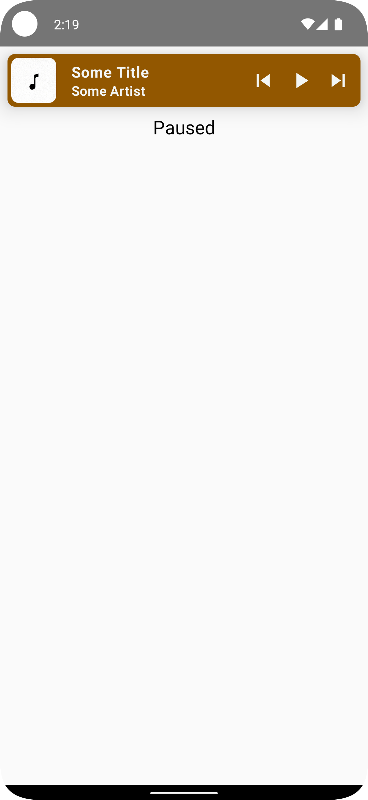

# FloatingPlaybackBarComposable

  

## Medium Article

This project is accompanied by a detailed Medium article titled "Intermediate Android Compose - Playback Bar." You can read the article [here](https://medium.com/@kenruizinoue/intermediate-android-composable-playback-bar-e03110cb3c95).

## Overview

`FloatingPlaybackBarComposable` is an Android UI built using Jetpack Compose. This project showcases the development of a `FloatingPlaybackBar()` composable, a key element in music apps for interactive music control and display.

Key features of the `FloatingPlaybackBarComposable` include:

- Dynamic Playback Control: Provides essential music playback controls, allowing users to play, pause, and navigate through tracks.
- State Management with Flow: Utilizes Kotlin Flow for real-time UI updates reflecting the current playback state and track details.
- Efficient Image Handling: Implements Coil for optimized image loading, enhancing the performance and aesthetic of album covers in the playback bar.
- Interactive UI Components: Incorporates responsive icons and touch interactions in the playback bar, offering a seamless user experience.

## Getting Started

1. Clone the repository to your local machine.
2. Open the project in Android Studio (preferably the latest version for full Compose support).
3. Run the app on an emulator or physical device to see the app in action.